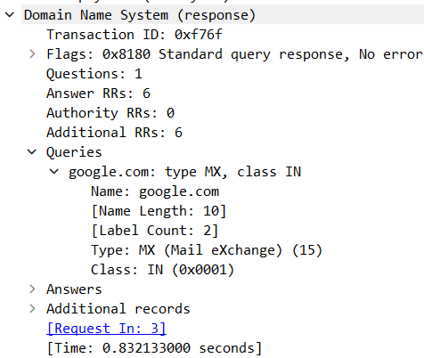

Nama : Muhammad Arief Satria Wibawa

NRP : 3122600015

Kelas : D4 IT A

**<h1 style="font-family:bahnschrift;">Analisis http.cap, telnet-cooked.cap, dan dns.cap pada Wireshark</h1>**

<h3 style="font-family:bahnschrift;">Pada wireshark, terdapat beberapa informasi yang bisa didapatkan, yakni :</h3>

* <h6 style="font-family:bahnschrift;">No, yang bertujuan menampilkan urutan paket data yang direkam</h6>
* <h6 style="font-family:bahnschrift;">Time, menampilkan waktu pada saat mengakses paket ke tujuan</h6>
* <h6 style="font-family:bahnschrift;">Source, menampilkan alamat ip pengguna/pengakses</h6>
* <h6 style="font-family:bahnschrift;">Destination, menampilkan alamat ip dari tujuan data</h6>
* <h6 style="font-family:bahnschrift;">Protocol, menampilkan informasi protocol pada saat mengakses data tersebut</h6>
* <h6 style="font-family:bahnschrift;">Info, menampilkan informasi yang ditampilkan pada proses capture data tersebut</h6>
 

<h4 style="font-family:bahnschrift;">1. http.cap</h6>

<h5 style="font-family:bahnschrift;">Pada snapshot dari file http.cap diatas, menampilkan informasi berbagai source, Destinasi, protocol, dsb. Dapat dilihat protocol yang berlangsung pada transaksi tersebut menggunakan TCP, DNS, dan HTTP.</h5>

<h5 style="font-family:bahnschrift;">Pada no-4, yang memiliki protocol HTTP dengan informasi /download.html HTTP/1.1, dapat dilihat pada bagian frame, yang berisi informasi sebagai berikut : </h5>

<h5 style="font-family:bahnschrift;">Pada bagian frame, berisi informasi arrival time koneksi tersebut dilakukan, yakni pada tanggal 13 Mei 2004  Selain itu, terdapat informasi panjang frame yang terkirim, yakni sebesar 533 bytes, atau setara dengan 4264 bits Kemudian ada informasi protocol yang digunakan dalam frame tersebut, yakni <strong>eth:ethertype:ip:tcp:https</strong></h5>

 
<h4 style="font-family:bahnschrift;">2. telnet-cooked.cap</h4>

<h5 style="font-family:bahnschrift;">Pada snapshot dari file telnet-cooked.cap diatas, menampilkan informasi berbagai source, Destinasi, protocol, dsb. Dapat dilihat protocol yang berlangsung pada transaksi tersebut menggunakan TCP, dan TELNET Pada nomor 5, dapat dilihat detail untuk frame yang berisi informasi sebagai berikut : </h5>

<h5 style="font-family:bahnschrift;">Pada snapshot diatas, dapat dilihat beberapa informasi yang berisi arrival time, pada 28 November 1999, Jumlah frame sebanyak 5, panjang frame sepanjang 69 Bytes, atau setara dengan 552 bits. </h5>

 
<h4 style="font-family:bahnschrift;">3. dns.cap</h4>

<h5 style="font-family:bahnschrift;">Pada snapshot dari file dns.cap diatas, menampilkan informasi berbagai source, Destinasi, protocol, dsb. Dapat dilihat protocol yang berlangsung pada transaksi tersebut menggunakan DNS.</h5>
<h5 style="font-family:bahnschrift;">Pada no-4, yang mana terdapat respon dari domain tertentu dengan beberapa detail sebagai berikut :  </h5>

<h5 style="font-family:bahnschrift;">Dapat dilihad pada snapshot tersebut bahwa domain yang memberikan response ialah google.com, dengan jawaban sebagai berikut :</h5>
