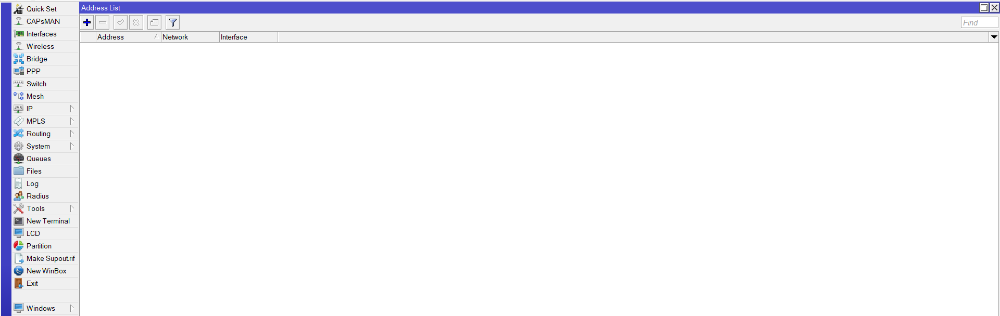

```Copy Code
Nama   : Muhammad Arief Satria Wibawa
NRP    : 3122600015
Kelas  : D4 IT A
```


**<h1 style="font-family:bahnschrift;">~ PENDAHULUAN</h1>**

***<h2 style="font-family:bahnschrift;">Mikrotik</h2>***

***<h4 style="font-family:bahnschrift;">1.1.Pengertian Mikrotik</h4>***
> <div class ="isi" style="font-family:bahnschrift;"> Mirkrotik ialah sistem operasi yang berbasis perangkat lunak (software) yang dipergunakan untuk menjadikan komputer sebagai router sebuah jaringan. Mikrotik juga menggunakan sistem operasi berbasis Linux dan menjadi dasar network router. Sistem operasi (OS) ini sangat cocok untuk membangun administrasi jaringan komputer yang berskala kecil hingga besar.
> 
***<h4 style="font-family:bahnschrift;">1.2.Fungsi Mikrotik</h4>*** 

- <div class ="isi" style="font-family:bahnschrift;"> Memberikan sistem otentikasi
- <div class ="isi" style="font-family:bahnschrift;"> Konfigurasi jaringan lokal
- <div class ="isi" style="font-family:bahnschrift;"> Mengelola sistem jaringan internet
- <div class ="isi" style="font-family:bahnschrift;"> Memberikan peran sebagai hotspot
- <div class ="isi" style="font-family:bahnschrift;"> Membuat PPPoE Server

***<h4 style="font-family:bahnschrift;">1.3. Jenis Mikrotik</h4>*** 

- <div class ="isi" style="font-family:bahnschrift;"> Mikrotik RouterOS  
  
    > Sistem operasi yang dipakai berbasis UNIX yang menyediakan fitur mulai dari paket router, bridge, firewall, proxy server, hotspot dan lain sebagainya. Dengan Mikrotik ini memungkinkan untuk membangun router sendiri hanya dengan menggunakan sebuah OS. 
    
- <div class ="isi" style="font-family:bahnschrift;"> RouterBoard
    
  >RouterBoard berukuran sangat kecil dan lebih praktis, yang dapat melakukan proses instalasi RouterOS pada RouterBoard yang telah terkonfigurasi dengan baik. RouterBoard terdiri dari sebuah processor, ROM, RAM, dan flash memory.

***<h4 style="font-family:bahnschrift;">1.4. Manfaat Mikrotik</h4>*** 

- <div class ="isi" style="font-family:bahnschrift;"> Sebagai <i>Internet Gateway</i> pada jaringan lokal
- <div class ="isi" style="font-family:bahnschrift;"> Sebagai penghubung antar jaringan, atau routing
- <div class ="isi" style="font-family:bahnschrift;"> Sebagai <i>Access point</i>

**<h1 style="font-family:bahnschrift;">~ PERCOBAAN</h1>**

***<h2 style="font-family:bahnschrift;">1. Mengatur Jaringan lokal menggunakan Winbox</h2>***

***<h3 style="font-family:bahnschrift;">1.1. Mengisi Address pada Address List</h3>***

 <br>

- <div class ="isi" style="font-family:bahnschrift;"> Isi address untuk router sesuai nomor kelompok
   <br>

  ><div class ="isi" style="font-family:bahnschrift;">  Kelompok 7 maka address kita isi dengan 10.252.108.17/24, network (10.252.108.0), dan interface ether1.
- <div class ="isi" style="font-family:bahnschrift;"> Isi IP address untuk tiap PC kelompok 7

   <br>

  ><div class ="isi" style="font-family:bahnschrift;">  Address kita isi dengan 192.168.7.1/24, network (192.168.7.0), dan interface bridge1.
  <div class ="isi" style="font-family:bahnschrift;"> Tampilan setelah terisi
   <br>

***<h3 style="font-family:bahnschrift;">1.2. Mengisi Route pada Route List</h3>***

 <br>

  - <div class ="isi" style="font-family:bahnschrift;"> Tambahkan Route baru   
     <br>

    ><div class ="isi" style="font-family:bahnschrift;">  Dst. Address kita isi dengan 192.168.1.0 dengan Gateway 10.252.108.11.

  - <div class ="isi" style="font-family:bahnschrift;"> Tambahkan route untuk semua kelompok (1-10)
     <br>

    > Lakukan cara yang sama untuk menambahkan route baru setiap kelompok.

***<h3 style="font-family:bahnschrift;">1.3. Menambahkan Bridge & Ports</h3>***

 <br>

- <div class ="isi" style="font-family:bahnschrift;">  Tambahkan interface

   <br>
  ><div class ="isi" style="font-family:bahnschrift;">  Isi Name dengan bridge1.
- <div class ="isi" style="font-family:bahnschrift;">Tambahkan Ports (untuk tiap kelompok)
   <br>
   <br>

***<h2 style="font-family:bahnschrift;">1.4. Melakukan PING antar kelompok</h2>***

- <div class ="isi" style="font-family:bahnschrift;"> Percobaan terhadap kelompok 1
   <br>

  > <div class ="isi" style="font-family:bahnschrift;"> Isi Name dengan bridge1.
- <div class ="isi" style="font-family:bahnschrift;"> Percobaan terhadap kelompok 2
   <br>

  > Proses ping dengan kelompok 1 dan 2 berhasil, hal yang sama dapat kita lakukan dengan kelompok lain (kelompok 3-10).

***<h2 style="font-family:bahnschrift;">2. Mengatur Topologi dalam Cisco Packet Tracer</h2>***
<div class ="isi" style="font-family:bahnschrift;"> Model dari topologi dibentuk sedemikian rupa sehingga menjadi sebagai berikut : <br>
 <br>

<div class ="isi" style="font-family:bahnschrift;">  Kemudian, mulai konfigurasi PC dan router dengan langkah sebagai berikut : 

***<h4 style="font-family:bahnschrift;">1. Konfigurasi PC</h4>***
- <div class ="isi" style="font-family:bahnschrift;"> Mengatur Default Gateway pada tiap PC sesuai kelompok<br>

  - Kelompok 7<br>
   <br>

  - <div class ="isi" style="font-family:bahnschrift;">  Kelompok 8<br>
     <br>

- <div class ="isi" style="font-family:bahnschrift;"> Mengisi IP address pada tiap PC sesuai kelompok<br>
  
  - Kelompok 7<br>
     <br>
     <br>
     <br>
  -  Kelompok 8<br>
     <br>
     <br>
     <br>

***<h4 style="font-family:bahnschrift;">2. Konfigurasi sub-Router</h4>*** 
- <div class ="isi" style="font-family:bahnschrift;"> Mengatur IP dan Subnet pada FastEthernet yang terhubung ke tiap PC (3 pc)<br>
  
  - Kelompok 7
     <br>
  - Kelompok 8
     <br>
- <div class ="isi" style="font-family:bahnschrift;"> Mengatur IP dan Subnet pada FastEthernet yang terhubung ke Router Utama
#### Kelompok 7
 <br>
 <br>
#### Kelompok 8
 <br>
 <br>

### Demikian Laporan Percobaan dari kelompok 7, dengan menggunakan winbox dan juga Cisco Packet Tracer