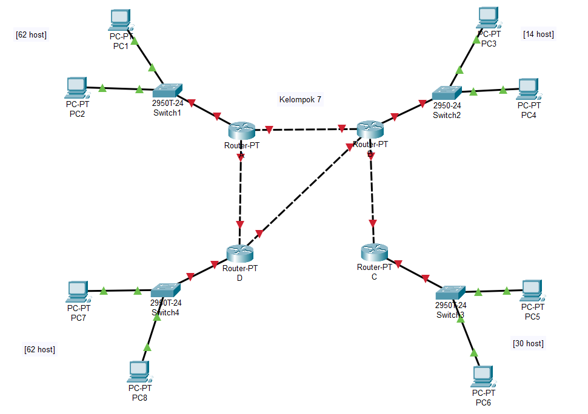

```Copy Code
Nama   : Muhammad Arief Satria Wibawa
NRP    : 3122600015
Kelas  : D4 IT A
```

**<h1 style="font-family:bahnschrift;">ROUTING</h1>**
><div class ="isi" style="font-family:bahnschrift;"> Merupakan proses pengiriman data dari satu host dalam satu network ke host dalam network yang lain. Data yang ditransfer dibagi menjadi unit-unit kecil yang disebut paket, dan setiap paket berisi informasi seperti alamat sumber dan tujuan. Ketika sebuah paket dikirim dari perangkat sumber, paket tersebut perlu melintasi beberapa perangkat jaringan, seperti router dan gateway, untuk mencapai tujuan. Routing sangat penting untuk komunikasi jaringan secara efisien karena dapat membantu pengiriman data melalui jaringan yang kompleks sekalipun.

<div class ="isi" style="font-family:bahnschrift;"> Routing sendiri dibagi menjadi 2, yakni Static Routing dan Dynamic Routing.

***<h4 style="font-family:bahnschrift;">1. Static Routing</h4>*** 
> <div class ="isi" style="font-family:bahnschrift;"> Merupakan proses setting router jaringan menggunakan tabel routing yang dikonfigurasikan secara manual oleh network administrator, yang mana administrator menentukan secara ekplisit lalu lintas yang digunakan untuk perjalanan paket dari satu perangkat ke perangkat lainnya.

- <div class ="isi" style="font-family:bahnschrift;">Karena setting router jaringan dilakukan secara manual, maka adminsitrator harus memperbarui secara manual jika ada perubahan, yang mana kurang cocok digunakan untuk jaringan besar yang memiliki banyak perubahan strukturnya.
- <div class ="isi" style="font-family:bahnschrift;">Kelebihan dari Static routing ialah penghematan bandwidth karena tidak ada bandwidth yang terbuang saat bertukar paket serta mendapatkan informasi dari isi tabel routing selama pertukaran paket.


***<h4 style="font-family:bahnschrift;">2. Dynamic Routing</h4>*** 

> <div class ="isi" style="font-family:bahnschrift;"> Merupakan sebuah proses setting router yang memiliki dan membuat tabel routing secara otomatis, dengan mendengarkan lalu lintas jaringan dan juga dengan saling berhubungan antara router lainnya. 
- <div class ="isi" style="font-family:bahnschrift;">Protokol routing mengatur router-router sehingga dapat berkomunikasi satu dengan yang lain dan saling memberikan informasi satu dengan yang lain dan saling memberikan informasi routing yang dapat mengubah isi forwarding table, tergantung keadaan jaringannya.
- <div class ="isi" style="font-family:bahnschrift;"> Karena konfigurasi disetting secara otomatis, maka administrator tidak perlu mengubah secara manual jika ada perubahan, dan lebih cocok untk digunakan untuk jaringan yang luas.

**<h1 style="font-family:bahnschrift;">ROUTER</h1>**
<div class ="isi" style="font-family:bahnschrift;">Ketika routing tentu saja kita memerlukan router. Router sendiri memiliki beberapa jenis, beberapa contohnya yakni Edge Router dan Core Router

***<h4 style="font-family:bahnschrift;">1. Edge Router</h4>*** 
> <div class ="isi" style="font-family:bahnschrift;">Digunakan untuk menghubungkan jaringan lokal (LAN) ke jaringan eksternal, seperti internet atau jaringan lainnya. Edge router bertanggung jawab untuk merutekan lalu lintas data antara LAN dan jaringan eksternal. Edge router juga biasanya menangani fungsi keamanan, seperti firewall dan intrusion detection system (IDS)

***<h4 style="font-family:bahnschrift;">2. Core Router</h4>*** 
> <div class ="isi" style="font-family:bahnschrift;">Digunakan untuk menghubungkan berbagai jaringan dalam sebuah organisasi. Core router bertanggung jawab untuk merutekan lalu lintas data antara jaringan-jaringan tersebut dengan efisiensi dan kinerja yang tinggi. Core router juga biasanya menangani fungsi-fungsi jaringan yang kompleks, seperti load balancing dan traffic shaping

**<h1 style="font-family:bahnschrift;">PERCOBAAN</h1>**

<div class ="isi" style="font-family:bahnschrift;"> Pada percobaan kali ini, kami akan membuat topologi jaringan dengan beberapa host dengan ilustrasi berikut <br>

<br>

<div class ="isi" style="font-family:bahnschrift;"> Kami menggunakan 2 PC untuk test pada tiap router, yang mewakili host yang telah diketahui.

```192.168.x.y```

<div class ="isi" style="font-family:bahnschrift;"> Maka kita perlu menentukan nilai x dan mencari nilai y terlebih dahulu. Untuk nilai x, kami menggunakan nilai 1-4 untuk tiap routernya. Untuk menentukanp prefix y yang sudah diketahui, perlu dilakukan langkah-langkah sebagai berikut :

***<h5 style="font-family:bahnschrift;">Router A</h5>*** 
```copy code
IP : 192.168.1.241
Mencari nilai m
Host = 62
62 = 2^m - 2
62 + 2 = 2^m
m = 6

Maka, hostnya memiliki 0 sebanyak 6 kali, dan 1 sebanyak 2 kali, sehingga netmasknya menjadi :
11111111.11111111.11111111.11000000/26
```

***<h5 style="font-family:bahnschrift;">Router B</h5>*** 
```copy code
IP : 192.168.2.242
Mencari nilai m
Host = 14
14 = 2^m - 2
14 + 2 = 2^m
m = 4
Maka, hostnya memiliki 0 sebanyak 4 kali, dan 1 sebanyak 4 kali, sehingga netmasknya menjadi :
11111111.11111111.11111111.11110000/28
```
***<h5 style="font-family:bahnschrift;">Router C</h5>*** 
```copy code
IP : 192.168.1.241
Mencari nilai m
Host = 30
30 = 2^m - 2
30 + 2 = 2^m
m = 5
Maka, hostnya memiliki 0 sebanyak 5 kali, dan 1 sebanyak 3 kali, sehingga netmasknya menjadi :
11111111.11111111.11111111.11100000/27
```
***<h5 style="font-family:bahnschrift;">Router D</h5>*** 
```copy code
IP : 192.168.1.241
Mencari nilai m
Host = 62
62 = 2^m - 2
62 + 2 = 2^m
m = 6
Maka, hostnya memiliki 0 sebanyak 6 kali, dan 1 sebanyak 2 kali, sehingga netmasknya menjadi :
11111111.11111111.11111111.11000000/26
```

<div class ="isi" style="font-family:bahnschrift;"> <strong>Setelah netmask dan prefixnya diketahui, maka kita bisa mencari subnet, host awal, host akhir dan IP broadcast dari masing-masing router. Daftarnya konfigurasnya antara lain : </strong>

***<h5 style="font-family:bahnschrift;">Router A</h5>*** 
```copy code
IP            : 192.168.1.241/26
Netmask       : 255.255.255.192 (11111111.11111111.11111111.11000000)
Subnet        : 192.168.1.128
Host Awal     : 192.168.1.129
Host Akhir    : 192.168.1.190
IP Broadcast  : 192.168.1.191
```

***<h5 style="font-family:bahnschrift;">Router B</h5>*** 
```copy code
IP            : 192.168.2.242/28
Netmask       : 255.255.255.240 (11111111.11111111.11111111.11110000)
Subnet        : 192.168.2.224
Host Awal     : 192.168.2.225
Host Akhir    : 192.168.2.238
IP Broadcast  : 192.168.2.239
```

***<h5 style="font-family:bahnschrift;">Router C</h5>*** 
```copy code
IP            : 192.168.1.243/27
Netmask       : 255.255.255.224 (11111111.11111111.11111111.11100000)
Subnet        : 192.168.3.192
Host Awal     : 192.168.3.193
Host Akhir    : 192.168.3.222
IP Broadcast  : 192.168.3.223
```

***<h5 style="font-family:bahnschrift;">Router D</h5>*** 
```copy code
IP            : 192.168.4.244/26
Netmask       : 255.255.255.192 (11111111.11111111.11111111.11000000)
Subnet        : 192.168.4.128
Host Awal     : 192.168.4.129
Host Akhir    : 192.168.4.190
IP Broadcast  : 192.168.4.191
```

<div class ="isi" style="font-family:bahnschrift;">Setelah mengetahui konfigurasi dari tiap router, kita bisa mengubah topologi pada packet tracer pada tiap router dan PC, sehingga membentuk topologi seperti berikut <br>
<br>
<div class ="isi" style="font-family:bahnschrift;">Dengan konfigurasi sebagai berikut <br>

***<h5 style="font-family:bahnschrift;">Router A</h5>*** 
<br>
<br>
<br>
<br>

- <div class ="isi" style="font-family:bahnschrift;">Untuk konfigurasi tiap PC, kami mencantumkan 1 contoh untuk konfigurasi default gateway-nya.<br>
    <br>
    <div class ="isi" style="font-family:bahnschrift;">Untuk IP address pada tiap PC-nya, dimulai dari 192.168.1.129 hingga 192.168.1.190

***<h5 style="font-family:bahnschrift;">Router B</h5>*** 
<br>
<br>
<br>
<br>
<br>

- <div class ="isi" style="font-family:bahnschrift;">Untuk konfigurasi tiap PC, kami mencantumkan 1 contoh untuk konfigurasi default gateway-nya.<br>
    <br>
    <div class ="isi" style="font-family:bahnschrift;">Untuk IP address pada tiap PC-nya, dimulai dari 192.168.2.225 hingga 192.168.2.238

***<h5 style="font-family:bahnschrift;">Router C</h5>*** 
<br>
<br>
<br>

- <div class ="isi" style="font-family:bahnschrift;">Untuk konfigurasi tiap PC, kami mencantumkan 1 contoh untuk konfigurasi default gateway-nya.<br>
    <br>
    <div class ="isi" style="font-family:bahnschrift;">Untuk IP address pada tiap PC-nya, dimulai dari 192.168.3.193 hingga 192.168.3.222

***<h5 style="font-family:bahnschrift;">Router D</h5>*** <br>
<br>
<br>
<br>

- <div class ="isi" style="font-family:bahnschrift;">Untuk konfigurasi tiap PC, kami mencantumkan 1 contoh untuk konfigurasi default gateway-nya.<br>
    <br>
    <div class ="isi" style="font-family:bahnschrift;">Untuk IP address pada tiap PC-nya, dimulai dari 192.168.4.129 hingga 192.168.4.190