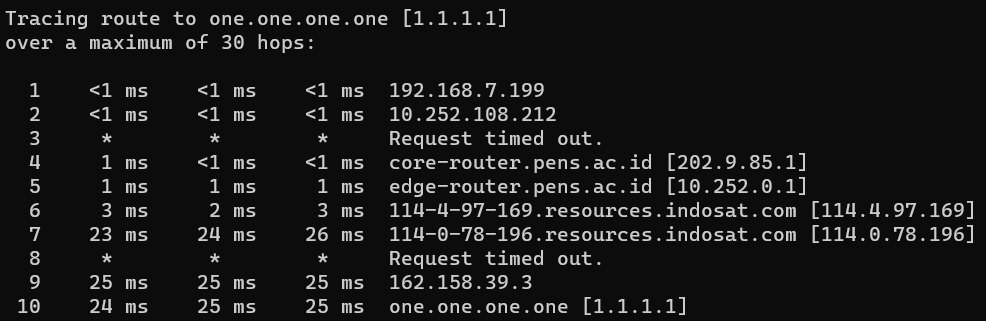
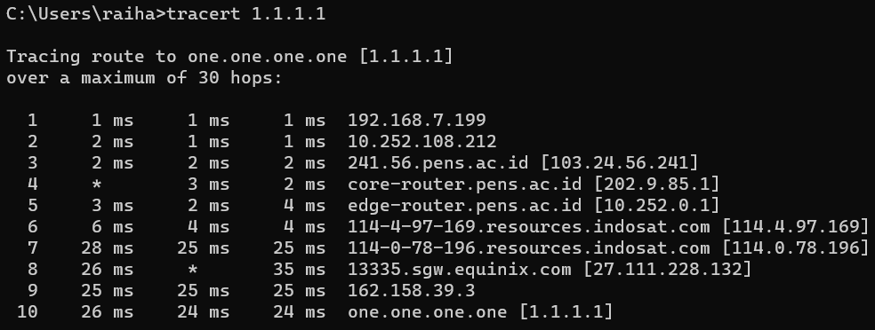
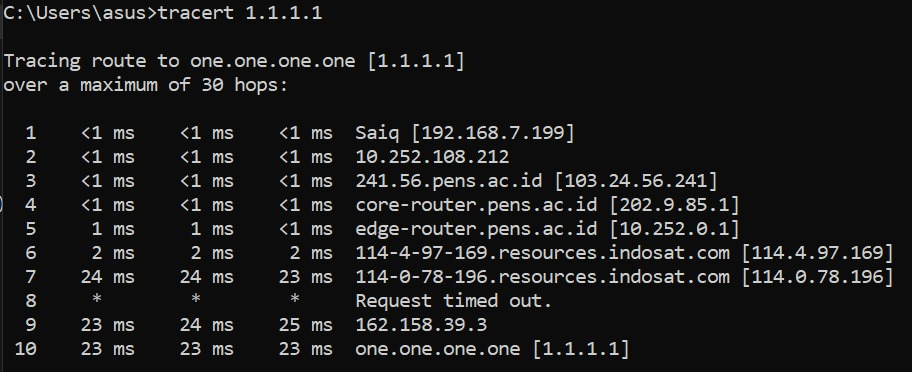
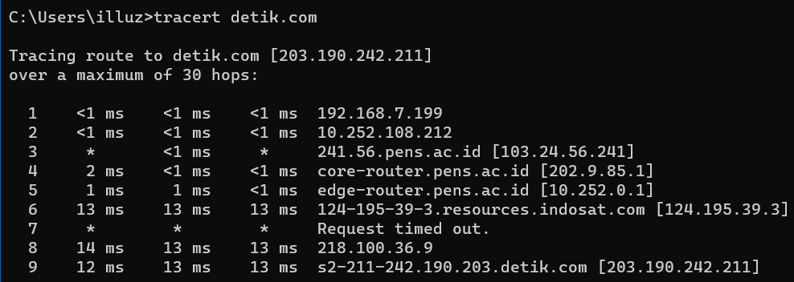
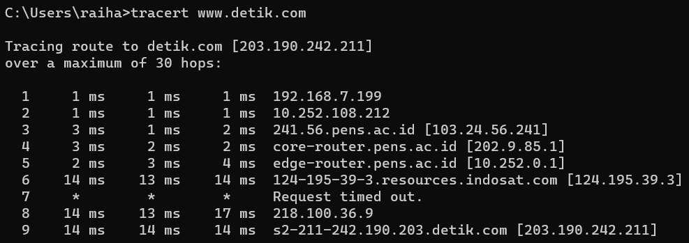
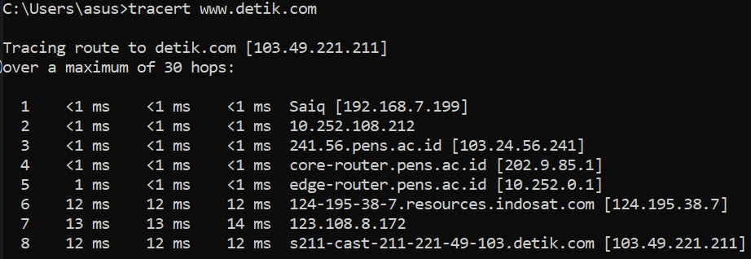

```Copy Code
Nama   : Muhammad Arief Satria Wibawa
NRP    : 3122600015
Kelas  : D4 IT A
```

**<h1 style="font-family:bahnschrift;">DHCP ROUTING</h1>**

**<h2 style="font-family:bahnschrift;">Ping ke 1.1.1.1</h2>**

><div class ="isi" style="font-family:bahnschrift;">percobaan 1<br>
<br>

><div class ="isi" style="font-family:bahnschrift;">percobaan 2<br>
<br>

><div class ="isi" style="font-family:bahnschrift;">percobaan 3<br>
<br>


**<h2 style="font-family:bahnschrift;">Ping ke detik.com</h2>**

><div class ="isi" style="font-family:bahnschrift;">percobaan 1<br>
<br>

><div class ="isi" style="font-family:bahnschrift;">percobaan 2<br>
<br>

><div class ="isi" style="font-family:bahnschrift;">percobaan 3<br>
<br>

**<h2 style="font-family:bahnschrift;">Analisis</h2>** <br>
    Gambar tersebut menunjukkan proses traceroute yang dimulai dari PC mahasiswa menuju <i>1.1.1.1</i> . Namun, terdapat tanda <strong>*</strong> pada beberapa percobaan terdapat beberapa tanda tersebut, yang berari packet yang dikirm tidak berhasil mencapai router tertentu. Jika sampai 3 kali maka akan muncul pesan <i>RTO (Request Timed Out)</i>. Tapi, mengapa packet yang dikirimkan masih bisa sampai ke IP tujian? Hal tersebut dikarenakan adanya retransmission yang dilakukan oleh protokol TCP yang memastikan bahwa semua packet yang dikirim akan diterima oleh tujuan.