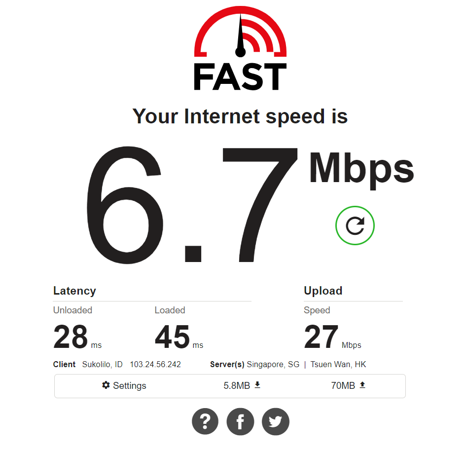
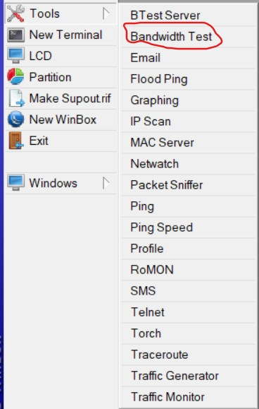
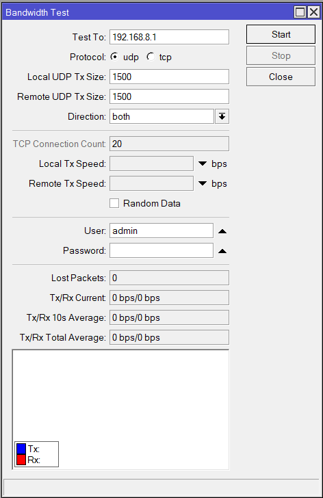
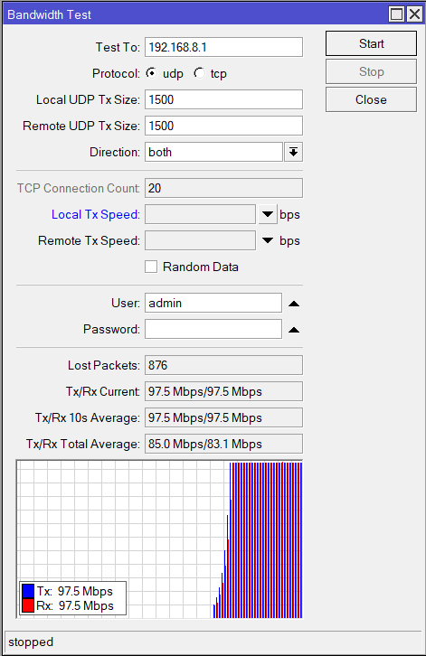
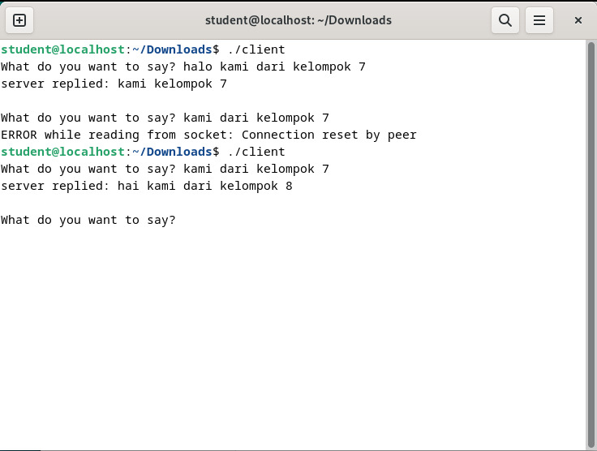
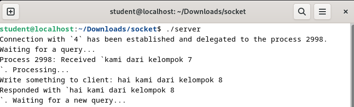

```Copy Code
Nama   : Muhammad Arief Satria Wibawa
NRP    : 3122600015
Kelas  : D4 IT A
```

**<h1 style="font-family:bahnschrift;">Bandwith Test Server</h1>**
><div class ="isi" style="font-family:bahnschrift;"> Melakukan pengetesan Bandwith ke fast.com
<div class ="isi" style="font-family:bahnschrift;">Dengan menggunakan Ethernet yang disambungkan ke PC mahasiswa, didapatkan kecepatan sebagai berikut : <br>
<br>

<div class ="isi" style="font-family:bahnschrift;">Kemudian, melakukan pengetesan menggunakan winbox dengan cara sebagai berikut :

><div class ="isi" style="font-family:bahnschrift;"> Melakukan bandwith test dengan klik tools > Bandwith Test
<br>

><div class ="isi" style="font-family:bahnschrift;">Kemudian akan muncul tampilan berikut, dan klik "Start untuk memulai pengecekan
<br>

><div class ="isi" style="font-family:bahnschrift;">Setelah selesai, akan muncul data seperti berikut
<br>

**<h1 style="font-family:bahnschrift;">Aplikasi Chat ke Lintas Kelompok</h1>**
><div class ="isi" style="font-family:bahnschrift;"> Dengan menggunakan program dari pertemuan sebelumnya, yakni server.c dan client.c kami kelompok 7 melakukan chat dengan kelompok 8, dengan mengubah client.c menjadi berikut
 <br>

```server = gethostbyname("192.168.8.198");```
- <div class ="isi" style="font-family:bahnschrift;"> Dari sisi client
    <br>

- <div class ="isi" style="font-family:bahnschrift;"> Dari sisi server
    <br>
