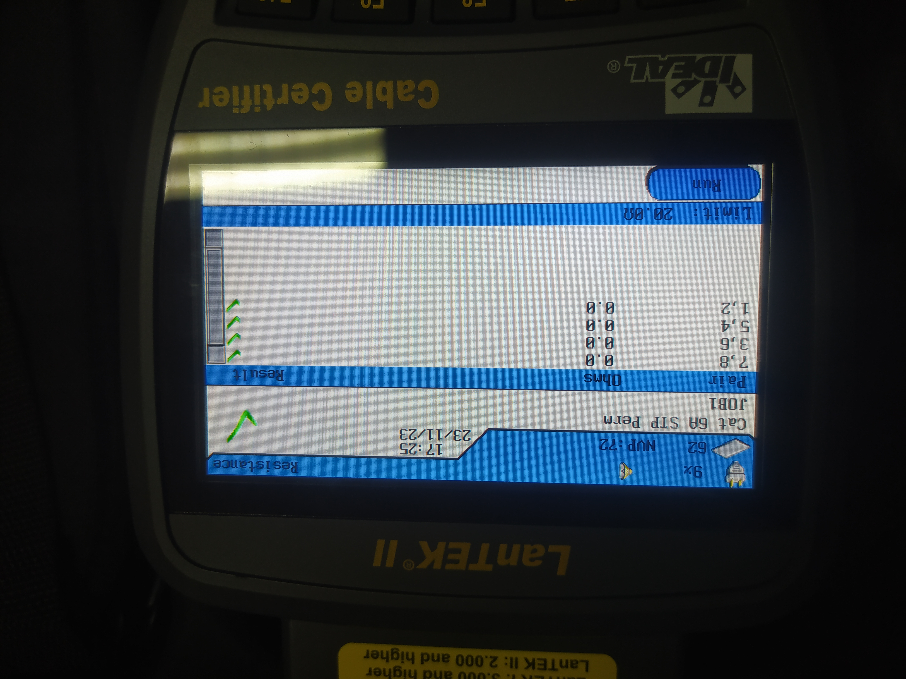
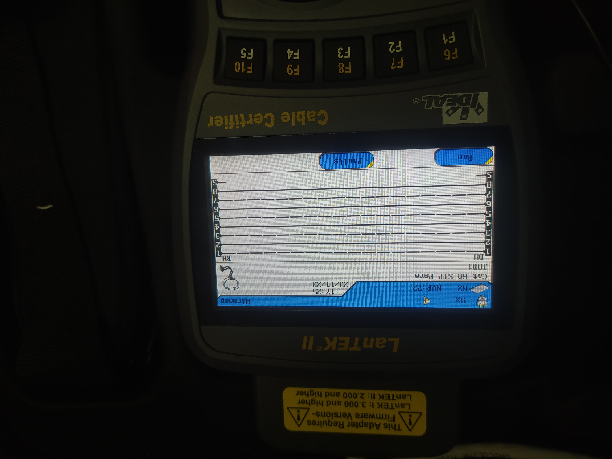
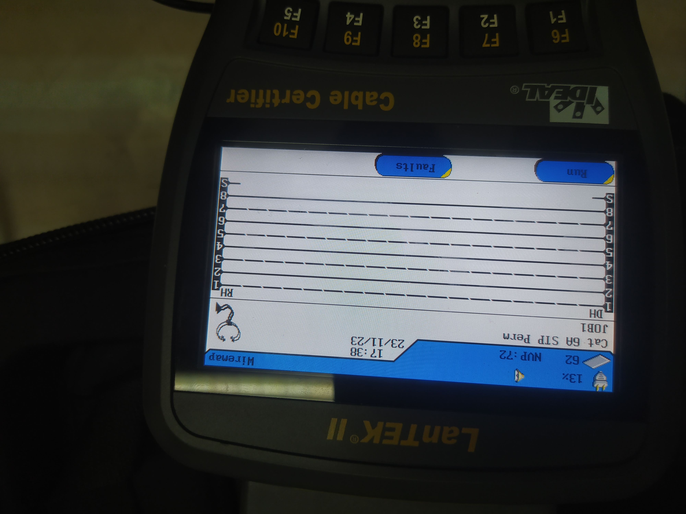
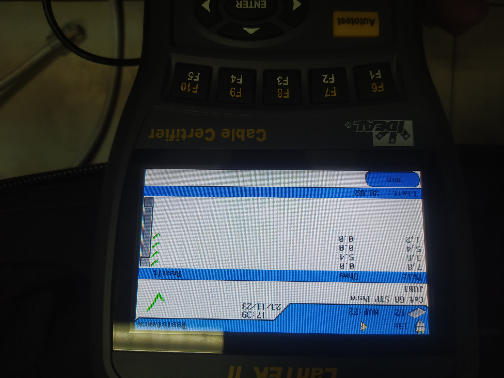

```Copy Code
   Nama  : Muhammad Arief Satria Wibawa
   NRP   : 3122600015
   Kelas : 2 D4 IT A
```
    
#  Tahapan Perakitan Kabel Straight
### I. Pendahuluan
   - *Tujuan:* Laporan ini disusun untuk memberikan panduan tentang tahapan pembuatan kabel straight.
   - *Definisi Kabel Straight:* Kabel straight digunakan untuk menghubungkan perangkat jaringan seperti komputer ke switch atau hub.

### II. Materi dan Alat
   - 2 meter kabel UTP (Unshielded Twisted Pair) CAT6.
   - 2 buah konektor RJ-45.
   - Tang.
   - Gunting kabel.
   - Krimp tool.
   - RJ-45 LAN Tester

### III. Tahapan Pembuatan

1. *Pemotongan Kabel:*
   - Gunakan gunting kabel untuk memotong UTP sesuai panjang yang dibutuhkan.

2. *Penataan Ujung Kabel:*
   - Rapihkan ujung kabel dengan merapikan untaiannya untuk memastikan tidak ada kawat yang terjepit.

3. *Pemasangan Konektor RJ-45:*
   - Sisipkan kabel ke dalam penutup konektor RJ-45 dengan memastikan setiap kawat masuk ke slot yang benar sesuai standar warna (biasanya T-568B atau T-568A).

4. *Penyusunan Kembali Kawat:*
   - Susun kawat sesuai dengan standar warna yang dipilih, pastikan tidak ada kawat yang terjepit atau melenceng dari slotnya.

5. *Penjepitan:*
   - Dengan hati-hati, gunakan tang untuk menekan penutup konektor dan menjepit kawat dengan kuat.

6. *Krimping:*
   - Gunakan krimp tool untuk mengekspose kawat ke dalam penutup konektor, pastikan koneksi yang kuat dan stabil.

7. *Pemeriksaan Visual:*
   - Periksa visual setiap konektor untuk memastikan tidak ada kawat yang terlewat atau koneksi yang longgar.

8. *Uji Kontinuitas:*
   - Gunakan alat uji RJ-45 LAN Tester untuk memastikan setiap kawat terhubung dengan benar dan tidak ada gangguan dalam kabel.
   - Kabel pertama
      <br><br>
      <br><br>
   - Kabel kedua
      <br><br>
      <br><br>
### IV. Kesimpulan
   - Pembuatan kabel straight memerlukan ketelitian dalam penataan kawat dan pemasangan konektor RJ-45.
   - Uji kontinuitas perlu dilakukan untuk memastikan kabel berfungsi dengan baik.

### V. Referensi
   - Buku Panduan Jaringan Komputer.
   - Standar TIA/EIA-568 untuk pemasangan konektor RJ-45.