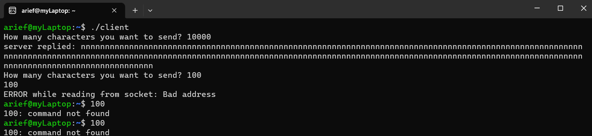

```
Nama  : Muhammad Arief Satria Wibawa</p>
NRP   : 3122600015</p>
Kelas : D4 IT A</p>
```

**<h1 style="font-family:bahnschrift;">SOCKET PROGRAMMING</h1>**

***<h2 style="font-family:bahnschrift;">Pengertian</h2>***
 <div class ="isi" style="font-family:bahnschrift;"> Socket adalah istilah yang digunakan dalam dunia komputer dan jaringan untuk merujuk pada mekanisme komunikasi antara dua komputer atau perangkat yang berbeda melalui jaringan. Socket memungkinkan komputer atau perangkat untuk mengirim dan menerima data satu sama lain melalui jaringan, seperti internet atau jaringan lokal (LAN).

***<h2 style="font-family:bahnschrift;">Jenis Socket</h2>***

***<h4 style="font-family:bahnschrift;">1. Socket Client</h4>***
> <div class ="isi" style="font-family:bahnschrift;">  Socket client adalah komponen yang memulai koneksi ke server atau endpoint lainnya. Client socket bertindak sebagai pengirim data ke server untuk diproses atau menerima data dari server sebagai respons.

***<h3 style="font-family:bahnschrift;">2. Socket Server</h3>***
> <div class ="isi" style="font-family:bahnschrift;">  Socket server adalah komponen yang mendengarkan dan menunggu koneksi dari client. Ketika ada permintaan koneksi dari client, server socket akan menerima koneksi dan memungkinkan komunikasi dua arah antara server dan client.
  **<div class ="isi" style="font-family:bahnschrift;"> Socket digunakan dalam berbagai protokol jaringan, seperti TCP (Transmission Control Protocol) dan UDP (User Datagram Protocol), untuk mengirim data antara perangkat dalam jaringan. Protokol ini memastikan bahwa data yang dikirimkan dapat diterima dengan benar dan dalam urutan yang tepat (TCP), atau memungkinkan pengiriman data yang lebih cepat tetapi tanpa jaminan pengiriman yang benar (UDP).**
  
***<h2 style="font-family:bahnschrift;">Run Program</h2>***
<div class ="isi" style="font-family:bahnschrift;">   1. Buka terminal dan navigasi ke folder file socket.
<div class ="isi" style="font-family:bahnschrift;">  2. Compile dan run file server.c
<div class ="isi" style="font-family:bahnschrift;">  3. Buka halaman terminal baru atau komputer lain, lalu compile dan run file client.c
<div class ="isi" style="font-family:bahnschrift;">  4. Ketik pada terminal client.c dan akan keluar pda terminal server.c (dengan menambahkan kode inputan dari server.c, kita dapat berkomunikasi antar client dan server).

