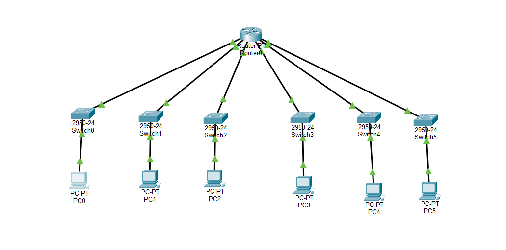
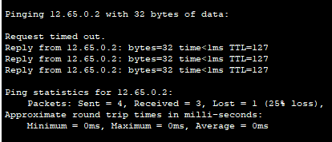
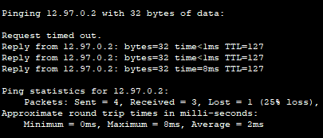
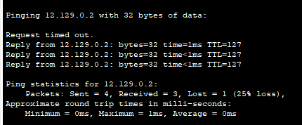
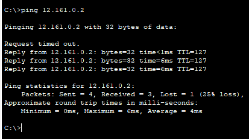
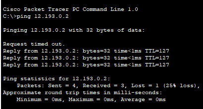

```Copy Code
Nama   : Muhammad Arief Satria Wibawa
NRP    : 3122600015
Kelas  : D4 IT A
```


**<h1 style="font-family:bahnschrift;">OFFICE FACILITY DENGAN PUBLIC IP : 12.0.0.0/8 & 6 SUBNET</h1>**
 <br>

<div class ="isi" style="font-family:bahnschrift;"> Pada percobaan yang pertama, digunakan 1 Router, 6 Switch, dan 6 PC

**<h3 style="font-family:bahnschrift;">Berikut adalah konfigurasi dari peragkat yang digunakan :</h3>**

**<h5 style="font-family:bahnschrift;">1. Menggunakan Router-PT, konfigurasi sebagai berikut :</h5>**

   - <div class ="isi" style="font-family:bahnschrift;"> FastEthernet(Fa) 0/0 : 12.32.0.1
   - <div class ="isi" style="font-family:bahnschrift;"> FastEthernet(Fa) 1/0 : 12.64.0.1
   - <div class ="isi" style="font-family:bahnschrift;"> FastEthernet(Fa) 6/0 : 12.96.0.1
   - <div class ="isi" style="font-family:bahnschrift;"> FastEthernet(Fa) 7/0 : 12.128.0.1
   - <div class ="isi" style="font-family:bahnschrift;"> FastEthernet(Fa) 0/0 : 12.160.0.1
   - <div class ="isi" style="font-family:bahnschrift;"> FastEthernet(Fa) 0/0 : 12.192.0.1

**<h5 style="font-family:bahnschrift;">2. Lakukan konfigurasi pada keempat PC dengan IP Address sebagai berikut :</h5>**

   - <div class ="isi" style="font-family:bahnschrift;"> PC0 => 12.33.0.2
   - <div class ="isi" style="font-family:bahnschrift;"> PC1 => 12.65.0.2
   - <div class ="isi" style="font-family:bahnschrift;"> PC2 => 12.97.0.2
   - <div class ="isi" style="font-family:bahnschrift;"> PC3 => 12.129.0.2
   - <div class ="isi" style="font-family:bahnschrift;"> PC3 => 12.161.0.2
   - <div class ="isi" style="font-family:bahnschrift;"> PC3 => 12.193.0.2

**<h5 style="font-family:bahnschrift;">3. Hubungkan seluruh komponen jaringan yang ada dengan menggunakan kabel tipe straight seperti yang terlihat pada gambar di atas. Jangan lupa mengaktifkan seluruh jaringan hingga ada tanda segitiga warna hijau. Pastikan subnet mask diganti dengan 255.224.0.0</h5>**
<br>

**<h1 style="font-family:bahnschrift;">MELAKUKAN PING TEST</h1>**

<div class ="isi" style="font-family:bahnschrift;"> Setelah selesai melakukan konfigurasi, selanjutnya adalah melakukan Ping test.

### 1. Ping 12.33.0.2 -> 12.65.0.2


> <div class ="isi" style="font-family:bahnschrift;">  Ketika perintah ping pertama kali dijalankan, maka akan terjadi broadcast dimana jika menggunakan switch broadcast hanya akan dijalankan sekali di awal ketika ingin menghubungkan suatu perangkat yang mana berfungsi untuk mencari dimana ip address yang dituju, setelah mendapatkan address yang dituju perangkat pengirim ping akan mendapatkan konfirmasi dan selanjutnya akan mengirim sebanyak 4 packets ke address yang dituju.

**<h5 style="font-family:bahnschrift;">2. Ping 12.65.0.2 -> 12.97.0.2</h5>**



**<h5 style="font-family:bahnschrift;">3. Ping 12.97.0.2 -> 12.129.0.2 </h5>**



**<h5 style="font-family:bahnschrift;">4. Ping 12.129.0.2 -> 12.161.0.2 </h5>**



**<h5 style="font-family:bahnschrift;">5. Ping 12.161.0.2 -> 12.193.0.2 (PT-Hub) </h5>**

