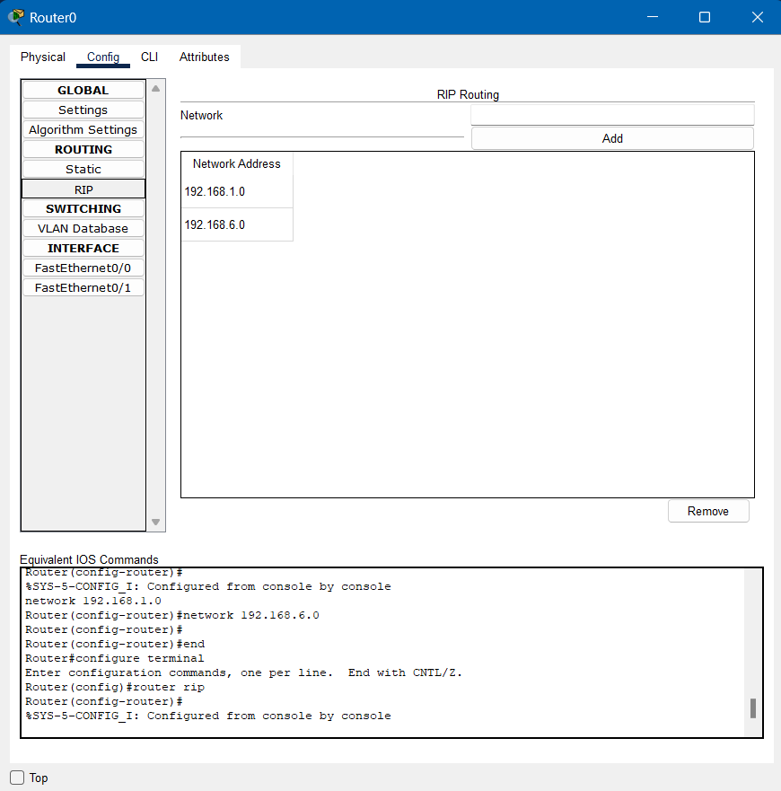

```Copy Code
Nama   : Muhammad Arief Satria Wibawa
NRP    : 3122600015
Kelas  : D4 IT A
```


**<h1 style="font-family:bahnschrift;">SIMULASI JARINGAN MENGGUNAKAN CISCO PACKET TRACER</h1>**

***<h2 style="font-family:bahnschrift;">Scenario yang digunakan : </h2>***
1. <div class ="isi" style="font-family:bahnschrift;"> Ping dari PC 0 ke PC 1 
2. <div class ="isi" style="font-family:bahnschrift;"> Ping dari PC 0 ke PC 1
3. <div class ="isi" style="font-family:bahnschrift;"> Ping dari PC 0 ke PC 2
4. <div class ="isi" style="font-family:bahnschrift;"> Ping dari PC 0 ke PC 3


***<h2 style="font-family:bahnschrift;">Persiapan</h2>***

- <div class ="isi" style="font-family:bahnschrift;"> Pertama-tama membuat desain rangkaian jaringan dengan 1 router, 2 switch, dan 4 PC sehingga menjadi tampilan sebagai berikut :
    
- <div class ="isi" style="font-family:bahnschrift;"> Lalu configure router dengan mengubah IP Fast Ethernet menjadi seperti berikut
    

- <div class ="isi" style="font-family:bahnschrift;"> Kemudian, configure IP address dan default gateway untuk masing-masing PC
    <br>
    <br>
    <br>
    <br>

- <div class ="isi" style="font-family:bahnschrift;"> Tambahkan RIP routing supaya bisa melakukan *ping* dengan PC yang berbeda switch
    

***<h2 style="font-family:bahnschrift;">Percobaan</h2>***

***<h4 style="font-family:bahnschrift;">1. Ping dari PC 0 ke PC 1 (broadcast)</h4>***
<div class ="isi" style="font-family:bahnschrift;"> Membuka command prompt pada PC 0, dan melakukan ping ke address PC 1
 <br>
Pada pengiriman pertama, PC 0 dan PC 1 melakukan broadcast, dimana PC 0 menghubungkan ke PC 1 dengan mencari IP addressnya. Setelah mendapatkan IP address dari PC 1, PC 0 sebagai pengirim, mengirimkan packet sebanyak 4 kali ke penerima, yaitu PC 1.
<br>


***<h4 style="font-family:bahnschrift;">2. Ping dari PC 0 ke PC 1 </h4>***
<div class ="isi" style="font-family:bahnschrift;"> Membuka command prompt pada PC 0, dan melakukan ping ke address PC 1 <br>
<br>
Pada pengiriman kedua ini, PC 0 dan PC 1 tidak melakukan broadcast, karena IP address dari PC 1 sudah dikenali, sehingga waktu untuk pengiriman packet pertama lebih cepat.<br>
<br>

***<h4 style="font-family:bahnschrift;">3. Ping dari PC 0 ke PC 2</h4>***

Membuka command prompt pada PC 0, dan melakukan ping ke address PC 2 <br>

Pada pengiriman kali ini, PC 0 mengirim packet menuju PC 2 yang mana berada dalam switch yang berbeda. Sama seperti percobaan sebelumnya, pengiriman packet pertama lebih lama dibandingkan yang sesudahnya karena ia melakukan broadcast terlebih dahulu, untuk mengenali IP address dari PC 2<br>


