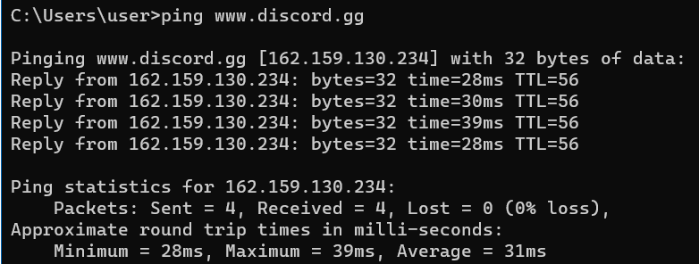
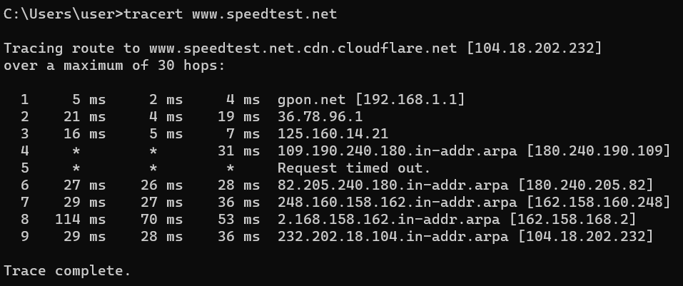

Nama : Muhammad Arief Satria Wibawa

NRP : 3122600015

Kelas : D4 IT A

**<h1 style="font-family:bahnschrift;">Ping dan Traceroute</h1>**

**<h2 style="font-family:bahnschrift;">1. Ping</h2>**

> 
 <em>Ping</em> ialah perintah yang digunakan untuk memeriksa koneksi jaringan antar dua komputer, dengan cara mengirimkan paket data ke host atau server dan menunggu respon. Koneksi akan dianggap aktif atau stabil jika respon diterima. <em>Ping</em> memiliki manfaat antara lain :
 
> 
>* 
Mengecek kondisi host, apakah aktif atau tidak 

>* 
Mengukur waktu respon yang diberikan oleh host 

>* 
Melihat kualitas koneksi internet berdasarkan hasil respon ping 

<h4 style="font-family:bahnschrift;"><strong>Cara kerja <em>ping</em></strong></h4>

> 
Ketika perintah ping dijalankan, komputer akan mengirim serentetan pesan Internet Control Message Protocol (ICMP) ke target host dan menunggu pesan *echo* dari dan ke host, dan perangkat. Pesan tersebut akan menampilkan informasi berupa hasil eksekusi jaringan.

**<h4 style="font-family:bahnschrift;">Informasi yang ditampilkan oleh perintah <em>ping</em></h4>**

<table style="font-family:bahnschrift;">
<tr>
    <td>Reply</td>
    <td>Balasan dari host, diikuti dengan alamat IP, yang memiliki kemungkinan untuk munculnya Request Timed Out (RTO)</td>
</tr>
<tr>
    <td>Bytes</td>
    <td>Jumlah data yang dikirimkan</td>
</tr>
<tr>
    <td>Time</td>
    <td>Waktu respon yang diberikan host</td>
</tr>
<tr>
    <td>Time To Live (TTL)</td>
    <td>Durasi paket selama berada di dalam jaringan, diukur dalam satuan second(detik)</td>
</tr>
</table>
 

**<h2 style="font-family:bahnschrift;">2. Traceroute atau Tracert</h2>**
> 
Traceroute atau tracert adalah perintah untuk melacak setiap rute jaringan yang dilalui oleh IP Address secara Real time dengan mengirimkan Internet Control Message Protocol (ICMP) Ke tujuan.

**<h4 style="font-family:bahnschrift;">Cara kerja <em>tracert</em></h4>**
> 
Tracert bekerja dengan cara melacak track route suatu jaringan dengan mengirimkan <em>ICMP</em> yang berfungsi untuk memberikan informasi apakah router yang digunakan dapat berjalan mentransfer data secara efektif atau tidak. 

**<h4 style="font-family:bahnschrift;">Informasi yang ditampilkan oleh perintah <em>tracert</em></h4>**

<table style="font-family:bahnschrift;">
<tr>
    <td>Hops</td>
    <td>Jumlah dari router atau network nodes yang dilewati paket selama perjalanan menuju tujuan</td>
</tr>
<tr>
    <td>IP address</td>
    <td>IP address pada tiap router atau network nodes yang dilalui paket</td>
</tr>
<tr>
    <td>RTT</td>
    <td>Waktu yang dibutuhkan paket menuju host dan kembali, diukur dalam satuan milisecond</td>
</tr>
<tr>
    <td>Time To Live (TTL)</td>
    <td>Batas waktu yang diberikan sebelum dibuang oleh     oleh router atau network nodes</td>
</tr>
<tr>
    <td>Status</td>
    <td>Status yang menandakan apakah paket yang dikirimkan berhasil diterima dengan baik di host atau tidak</td>
</tr>
</table>

