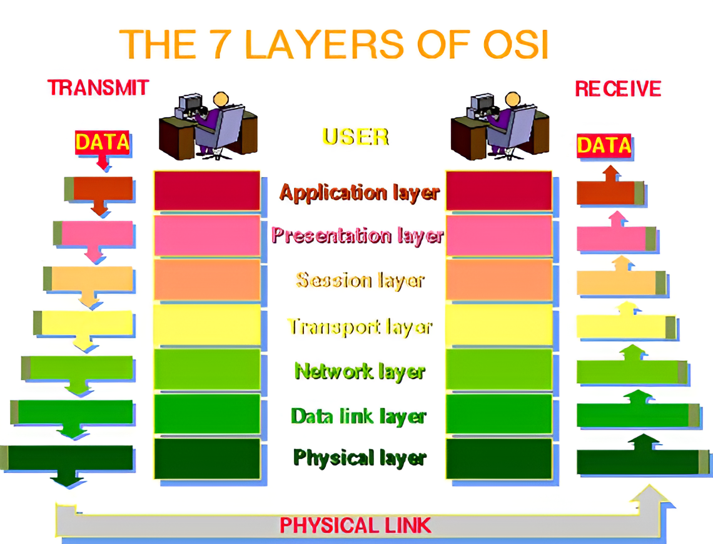

###### Nama  : Muhammad Arief Satria Wibawa
###### NRP : 3122600015
###### Kelas : 3 D4 IT A
#
#
# OSI (Open System Intercoinnection)
>OSI ialah model arsitektur jaringan yang digunakan untuk mempermudah pemahaman cara kerja jaringan komputer. Model OSI digunakan untuk mengembangkan porotokol-protokol jaringan yang digunakan untuk komunikasi antar device.
#
#
# _Layer pada OSI_

### _1. Physical Layer_ 
> Layer ini merupakan layer terendah yang ada pada OSI, yang bertanggungjawab dalam perpindahan data antar device. Layer ini menetapkan rincian elektrikal, mekanikal, dan prosedural untuk bagaimana data ditransfer melalui perantara fisik, yakni melalui kabel atau sinyal wireless. 

### _2. Data Link Layer_
> Layer ini bertanggungjawab dalam memastikan ketidak-adanya error dalam perpindahan data antar device pada perantara yang sama. Layer ini juga dapat memperbaiki error yang terjadi pada perpindahan data serta mengatur kecepatan arus perpindahan data agar tidak terlalu cepat bagi penerima.

### _3. Network Layer_
> Layer ini bertanggungjawab dalam routing data antar device yang tidak terhubung secara langsung. Layer ini menggunakan routing protocol untuk menentukan pathpaling optimal untuk jalanya data antar device.

### _4. Transport Layer_
> Layer ini bertanggungjawab dalam jalanya perpindahan data tanpa adanya error sampai ke tujuan akhir. Layer ini menggunakan beberapa mekanisme untuk memastikan lancarnya perpindahan data, seperti retransmission, nomor urut, dan header.

### _5. Session Layer_
> Layer ini bertanggungjawab dalam mengatur komunikasi antar aplikasi. Layer ini menyusun, memanage, dan mengakhiri communication session antar aplikasi.  

### _6.Presentation Layer_
> Layer ini bertanggungjawab dalam formatting data yang dapat dimengerti oleh Application Layer. Layer ini memungkinkan untuk meng-convert data ke format lainnya. 

### _7. Application Layer_
> Layer ini bertanggungjawab dalam formatting data yang dapat dimengerti oleh Application Layer. Layer ini memungkinkan untuk meng-convert data ke format lainnya. 
#
#
## _Bagaimana data ditransfer?_
### *Tahap 1*
>User memberikan perintah atau data pada aplikasi, dan diterjemahkan ke format yang dapat ditransfer melalui jaringan mengirimkannya ke Transport Layer.
### *Tahap 2*
>Transport Layer memecah data menjadi segment-segment dan menambahkan header pada tiap segment-nya yang berisi informasi kontrol, kemudian mengirimkan segment-segment itu ke Network Layer.
### *Tahap 3*
>Network Layer mendefinisikan tiap address untuk setiap host, dan menambahkan header yang berisi informasi device address tujuan, dan mengirimkannya ke Physical Layer

### *Tahap 4*
>Data Link Layer mendefinisikan device address pada jaringan, dan menambahkan header dan footer pada tiap segment yang berisi informasi device address tujuan, dan mengirimkannya ke Physical Layer

### *Tahap 5*
>Pada Physical Layer, segment tersebut ditransfer dalam bentuk bit, melalui media fisik, melalui kabel fiber, optik, ataupun wireless.

### *Tahap 6*
>Setelah data sampai pada host tujuan, proses selanjutnya dibalik, dari tahap 5 ke tahap 1, hingga sampai ke layer atas, dengan menghapus tiap header pada tiap layer, dan sampai pada user pada Application Layer